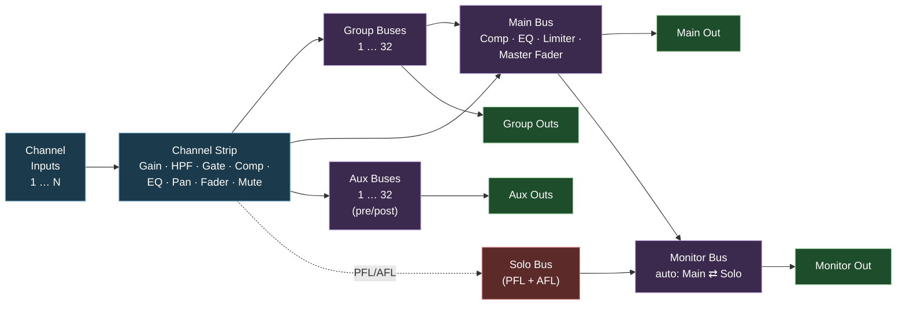
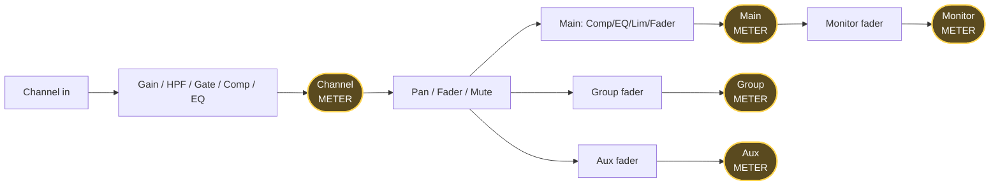

# Audio Mixer — Operator Guide

> **Code is the source of truth.** This guide describes intended behaviour and may have
> drifted from the current implementation. When in doubt, read the code and check the in-app UI.

A reference to the internal routing, signal flow and tap points of the
strom **Audio Mixer** block. Written for audio engineers and mixer
operators — no software internals, just signal flow.

The mixer behaves like a small digital console (Behringer X32 / Yamaha
TF family). If you know one of those, the layout will feel familiar.

---

## 1. At a glance



| Input/output | Count | Notes |
|---|---|---|
| Channel inputs | 1 – 128 (default 8) | Stereo. Set at construction time. |
| Aux buses | 0 – 32 (default 0) | Stereo. Each send is pre- or post-fader (per channel × bus). |
| Groups (subgroups) | 0 – 32 (default 0) | Stereo. Each group has its own output **and** also feeds Main. |
| Main output | 1 | Stereo. |
| Monitor output | 1 | Stereo. Follows Main, switches to Solo bus on PFL/AFL. |

---

## 2. Channel strip

Each channel is identical and is processed in this order:

```
                ┌─────────────────────────────────────────────────┐
                │                                                 │
INPUT  ──►  GAIN ──► HPF ──► GATE ──► COMP ──► EQ ──► METER ──► [TAP A] ──► PAN ──► FADER ──► [TAP B] ──►  ROUTING
              (dB)    (Hz)                                         │                  + MUTE         │              │
                                                                  │                                  │              ├──► Main
                                                                  │                                  │              ├──► Group 1…N
                                                                  │                                  │              └──► (aux sends, see below)
                                                                  │                                  │
                                                                  │   ┌──────────────────────────────┘
                                                                  ▼   ▼
                                                               [Pre-fader tap]   [Post-fader tap]
                                                                  │   │
                                                                  │   ├──► PFL (Pre-Fader Listen)
                                                                  │   └──► AFL (After-Fader Listen)
                                                                  │
                                                                  └──► Pre-fader aux sends
                                                                       (Post-fader aux sends take from [TAP B])
```

The channel **METER** is tapped pre-fader (right after EQ, before pan /
fader / mute). It shows the signal hitting the fader regardless of fader
position or mute — convention is *inputs metered pre-fader, outputs
(buses) metered post-master*. Use PFL/AFL when you want to listen to
the pre- or post-fader signal.

### Stages

| # | Stage | Range / type | Notes |
|---|---|---|---|
| 1 | **Input Gain** | −20 dB … +20 dB | Trim. Sets working level into the channel processing. |
| 2 | **HPF** | 20 Hz … 500 Hz, 24 dB/oct | Bypass when disabled. Default cutoff 80 Hz. |
| 3 | **Gate** | Threshold −60 … 0 dB, Attack 0–200 ms, Release 10–1000 ms | Stereo gate. Defaults: −40 dB / 5 ms / 100 ms. |
| 4 | **Compressor** | Thresh −60…0 dB · Ratio 1:1…20:1 · Atk 0–200 ms · Rel 10–1000 ms · Makeup 0…+24 dB · Knee −24…0 dB | Stereo. Defaults: −20 dB / 4:1 / 10 ms / 100 ms / 0 dB / −6 dB. |
| 5 | **EQ** | 4 bell bands (Low / Low-Mid / Hi-Mid / High), Gain −15 … +15 dB, Q 0.1 … 10 | Default freqs: 80 / 400 / 2000 / 8000 Hz. All bands flat by default. |
| 6 | **Pan** | −1.0 = hard L · 0.0 = centre · +1.0 = hard R | Constant-power panorama. |
| 7 | **Fader** | 0.0 … 2.0 (linear gain, ≈ −∞ dB … +6 dB) | 1.0 = unity. A short 20 ms anti-zipper ramp is applied to fader moves. |
| 8 | **Mute** | On/Off | A 30 ms anti-click ramp is applied automatically on mute toggle. |
| 9 | **Meter (channel)** | RMS + Peak + Decay, 100 ms update | **Pre-fader, post-EQ/dynamics.** Shows the signal hitting the fader — independent of fader position and mute. Use AFL to read the post-fader signal. |

Each processing stage (HPF, Gate, Comp, EQ) has an independent **on/off
enable** — when disabled the audio passes through unaltered, so the
settings are preserved while you compare.

### Tap points

There are two tap points per channel that determine where signals branch off:

| Tap | Location | Used by |
|---|---|---|
| **A — Pre-fader** | After EQ, before Pan/Fader/Mute | • Channel meter<br>• PFL listen<br>• Pre-fader aux sends (monitor / IEM feeds) |
| **B — Post-fader** | After Fader, after Mute | • AFL listen<br>• Post-fader aux sends (FX / headphone sends)<br>• Routing to Main / Groups |

> **Why this matters.** A *pre-fader* feed is **independent** of the
> channel fader and mute — useful for stage monitor mixes where the
> performer's level should not change when the FOH engineer pulls the
> fader. A *post-fader* feed **tracks** the fader and mute — what you
> hear in the room is proportional to what you send to that bus.

---

## 3. Routing — channel to buses

Every channel can be independently routed to **Main**, to any of the
**Groups**, and to any of the **Aux** buses.

```
                                          ┌──────────► MAIN  (on/off)
                                          │
[Channel post-fader] ───► ROUTING TEE ────┼──────────► GROUP 1 (on/off)
                                          ├──────────► GROUP 2 (on/off)
                                          │                ⋮
                                          └──────────► GROUP N (on/off)


[Channel pre-fader]  ──┐
                       ├──► (pre/post selector, per channel × per bus)
[Channel post-fader] ──┘                │
                                        ▼
                                  AUX SEND LEVEL (0.0–2.0)
                                        │
                                        ▼
                                    AUX BUS 1…M
```

- **To Main / To Group N** are **routing switches** (on/off). The bus
  master controls the final level.
- **Aux Sends** have an **individual send level per channel × per bus**
  (0.0 = no send, 2.0 = +6 dB send). Each aux send can independently
  be set to pre-fader or post-fader.
- **All aux buses default to *post-fader***. Flip a bus to pre-fader
  when using it for stage monitors or IEMs.

### Quick routing matrix view

```
                  Main   Grp1   Grp2   …   Aux1(post)  Aux2(post)   Aux3(pre)  …
        Ch 1      [ x ]  [   ]  [ x ]  …    0.85 ───      0.40 ───    1.00 ┄┄┄
        Ch 2      [ x ]  [ x ]  [   ]  …    0.00          0.60 ───    0.50 ┄┄┄
        Ch 3      [   ]  [ x ]  [ x ]  …    1.00 ───      0.00        0.00
         ⋮                                                ┄┄ = pre-fader   ─── = post-fader
```

---

## 4. The buses

### 4.1 Main bus

```
   Channel sends ──►  MAIN MIX  ──►  COMP  ──►  EQ  ──►  LIMITER  ──►  MASTER FADER + MUTE  ──►  METER  ──►  MAIN OUT
   Group   sends ──►
```

| Stage | Range | Default | Notes |
|---|---|---|---|
| **Comp** | Thresh −60…0 · Ratio 1:1…20:1 · Atk 0–200 ms · Rel 10–1000 ms · Makeup 0…+24 dB · Knee −24…0 dB | disabled, same defaults as channel comp | Bus glue compressor. |
| **EQ** | 4 bell bands, Gain ±15 dB, Q 0.1–10 | disabled, flat (80 / 400 / 2000 / 8000 Hz) | Tonal correction of the whole mix. |
| **Limiter** | Threshold −20 … 0 dB | disabled, −3 dB | Final brick-wall. Leave enabled in live use. |
| **Master Fader** | 0.0 … 2.0 (≈ −∞ … +6 dB) | 1.0 (unity) | Anti-zipper 20 ms ramp. |
| **Main Mute** | On/Off | Off | 30 ms anti-click ramp on toggle. |
| **Meter (main)** | RMS + Peak + Decay | always on | **Tap is post-master-fader/mute, post-limiter** — true output level. |

### 4.2 Group buses (subgroups)

Groups are stereo subgroups. Each group:

- has its own **master fader and mute**,
- has its own **dedicated meter**,
- has its own **output pad** (e.g. for stems / multitrack),
- **also feeds the Main bus** — so a group acts like a sub-master.

```
              ┌──► GROUP OUT  (stem)
              │
   Channels ─►│  GROUP MIX ──► GROUP FADER + MUTE ──► METER ──┤
              │                                                │
              └────────────────────────────────────────────────┴──► to MAIN
```

### 4.3 Aux buses

Aux buses are stereo. Each aux bus:

- has its own **master fader and mute**,
- has its own **dedicated meter**,
- has its own **output pad** (FX engine, IEM transmitter, recorder, …),
- does **NOT** feed Main.

```
   Channel sends (per-ch level, pre or post) ──►  AUX MIX ──► AUX MASTER + MUTE ──► METER ──► AUX OUT
```

### 4.4 Monitor & Solo bus

The mixer has an intelligent Monitor bus designed for control-room /
headphone monitoring.

```
     ┌─ from EVERY channel ────────────────────────────────┐
     │   PFL tap (pre-fader)  ─► PFL switch ──┐            │
     │   AFL tap (post-fader) ─► AFL switch ──┤            │
     │                                        ▼            │
     │                                   SOLO MIX          │
     └────────────────────────────────────────┬────────────┘
                                              │
                                       [SOLO → MON gate]──┐
                                                          ▼
                              MAIN OUT  ──► [MAIN → MON gate]──► MONITOR MIX ──► MONITOR FADER ──► METER ──► MONITOR OUT
```

**Behaviour:**

- When **no channel** has PFL or AFL active, the Monitor bus is fed by
  the **Main output** — you hear what FOH hears.
- As soon as **any channel** has PFL or AFL engaged, the Monitor bus
  **automatically switches** to the **Solo bus** — you hear only the
  soloed channels.
- Release all PFL/AFL buttons → Monitor returns to Main.

The switchover is fully automatic. The operator only presses **PFL** or
**AFL** on individual channels; the monitor source follows.

| Button | Listens to | Affected by channel fader? |
|---|---|---|
| **PFL** | Channel pre-fader tap | **No** — independent of fader/mute. |
| **AFL** | Channel post-fader tap | **Yes** — tracks fader and mute. |

Multiple PFL/AFL channels can be active simultaneously — they sum into
the Solo bus.

---

## 5. Metering — tap-point summary



| Meter | Where it taps | What it shows |
|---|---|---|
| Channel meter | **Pre-fader, post-EQ/dynamics** | The signal hitting the fader — independent of fader position and mute. Use AFL to listen to the post-fader signal. |
| Group meter | **Post-group-fader/mute** | Group output level. |
| Aux meter | **Post-aux-master/mute** | Aux output level. |
| Main meter | **Post-master-fader/mute, post-limiter** | True main output level. |
| Monitor meter | **Post-monitor-fader** | What's going to the monitor out (Main or Solo). |

All meters update at **100 ms** and report RMS, Peak and Decay.

---

## 6. Defaults reference

### Channel strip defaults

| Parameter | Default |
|---|---|
| Input Gain | 0 dB |
| Pan | 0.0 (centre) |
| Fader | 1.0 (unity, 0 dB) |
| Mute | Off |
| HPF | disabled, 80 Hz |
| Gate | disabled, −40 dB / 5 ms / 100 ms |
| Compressor | disabled, −20 dB / 4:1 / 10 ms / 100 ms / 0 dB makeup / −6 dB knee |
| EQ | disabled, all bands flat (80 / 400 / 2000 / 8000 Hz, Q = 1) |
| PFL / AFL | Off (not saved with the project) |
| Route to Main | **On** |
| Route to Group N | Off |
| Aux send level | 0.0 |
| Aux send pre/post | **post-fader** |

### Bus / global defaults

| Parameter | Default |
|---|---|
| Number of channels | 8 |
| Number of aux buses | 0 |
| Number of groups | 0 |
| Main fader | 1.0 (unity) |
| Main mute | Off |
| Main Compressor | disabled |
| Main EQ | disabled, flat |
| Main Limiter | disabled, −3 dB |
| Group / Aux master fader | 1.0 (unity) |
| Group / Aux master mute | Off |
| Monitor master fader | 1.0 (unity) |

### Anti-click / anti-zipper

| Event | Ramp time |
|---|---|
| Any fader move | 20 ms |
| Any mute toggle (channel / group / aux / main) | 30 ms |

These are short enough to feel instant but long enough to suppress the
discontinuity click of a hard step.

---

## 7. Limits

| | Min | Max |
|---|---|---|
| Channels | 1 | 128 |
| Aux buses | 0 | 32 |
| Groups | 0 | 32 |
| EQ bands per strip | — | 4 (Low / Low-Mid / Hi-Mid / High) |

Channel count, aux-bus count and group count are **construction-time
properties** — they define how the mixer is built and require restarting
the flow to change. Everything else (faders, mutes, sends, processing
parameters, routing switches, PFL/AFL) is live-editable.

---

## 8. Glossary

| Term | Meaning |
|---|---|
| **Pre-fader** | Tapped *before* the channel fader and mute — independent of them. |
| **Post-fader** | Tapped *after* the channel fader and mute — tracks them. |
| **PFL** | Pre-Fader Listen. Solo-style listen tap from before the fader. |
| **AFL** | After-Fader Listen. Solo-style listen tap from after the fader. |
| **Solo bus** | Internal mix that sums all active PFL + AFL sends. |
| **Monitor bus** | The bus driving the operator's control-room / headphone output. Automatically fed by Main, or by Solo when any PFL/AFL is engaged. |
| **Group / Subgroup** | A stereo sub-master that channels can be routed into. Has its own output **and** feeds Main. |
| **Aux bus** | A stereo send bus, independent of Main. Used for FX, monitors, IEMs, recorders. Each channel has its own send level into each aux. |
| **Route to Main / Group** | A simple on/off routing switch. The destination bus's master fader sets the final level. |
